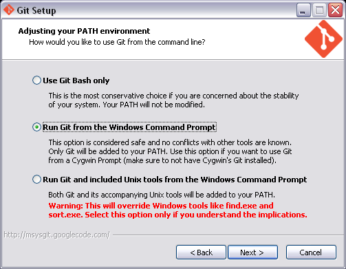
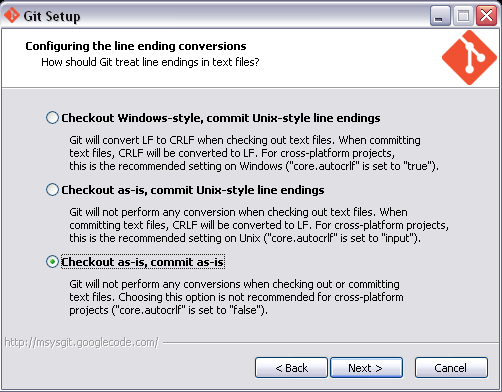

.. _installing:

==========
Installing
==========

This guide describes Lantz requirements and provides platform specific
installation guides. Examples are given for Python 3.2, installing all
optional requirements as site-packages and Lantz in a virtual environment
using `pip`_ and `git`_

Requirements
------------

Lantz core requires only `Python`_ 3.2+.

Optional requirements
---------------------

Some lantz subpackages have other requirements which are listed below together
with a small explanation of where are used. Short installation instructions are
given, but we refer you to the package documentation for more information. For some
packages, a link to the binary distribution is given.

    - `Colorama`_ is used to colorize terminal output.
      It is optional when logging to screen and mandatory if you want to use `lantz-monitor`, the text-based log viewer.
      You can install it using::

        $ pip install colorama

    - `Sphinx`_ is used generate the documentation.
      It is optional and only needed if you want to generate the documentation yourself.
      You can install it using::

        $ pip install sphinx

    - `Docutils`_ is used to transform the RST documentation to HTML which is then provided as tooltips in the GUI.
      It is optional. If not installed, unformatted documentation will be shown as tooltips.
      It will be already installed if you install Sphinx. To install it independently::

        $ pip install docutils

    - `pySerial`_ it is to communicate via serial port.
      It is optional and only needed if you are using a driver that uses lantz.serial.
      You can install it using::

        $ pip install pyserial

      Or use the `PySerial binaries`_

    - `Qt4`_ is used to generate the graphical user interfaces. Due to a license issue there
      are two python bindings for Qt: `PyQt`_ and `PySide`_.
      Both are compatible with Lantz.
      To install pyQt::

        $ pip install pyqt

      or use the `PyQt binaries`_

        $ pip install pyside

      or use the `PySide binaries`_

    - `NumPy`_ is used by many drivers to perform numerical calculations.
      You can install it using::

        $ pip install numpy

      or use the `NumPy binaries`_

    - `VISA`_ National Instruments Library for communicating via  GPIB, VXI, PXI,
      Serial, Ethernet, and/or USB interfaces

Linux
-----

Most linux distributions provide packages for Python 3.2, NumPy, PyQt (or PySide)
and git. Install them.

Download and install `VISA`_.

Open a terminal to install pip and virtualenv::

    $ curl http://python-distribute.org/distribute_setup.py | python3.2
    $ curl https://raw.github.com/pypa/pip/master/contrib/get-pip.py | python3.2

Using pip, install all other optional dependencies::

    $ pip-3.2 install virtualenv colorama sphinx pyserial

Change to the folder where you will create your virtual environment. In this
case, we have chosen the home directory::

    $ cd ~
    $ virtualenv -p python3.2 --system-site-packages lantzenv
    $ cd lantzenv
    $ source bin/activate

and then install an editable package::

    $ pip install -e git+gitolite@glugcen.dc.uba.ar:lantz.git#egg=lantz

or from `Lantz at Github`_::

    $ pip install -e git+git://github.com/hgrecco/lantz.git#egg=lantz

You will find the code in `~/lantzenv/src/lantz`.

The folder is a normal git repository from where you can pull and push to keep
the repo in sync.

Mac
---

Download and install `Python`_, `NumPy binaries`_, `PyQt binaries`_, `VISA`_
and `git binaries`_

Open a terminal to install pip and virtualenv::

    $ curl http://python-distribute.org/distribute_setup.py | python3.2
    $ curl https://raw.github.com/pypa/pip/master/contrib/get-pip.py | python3.2

Using pip, install all other optional dependencies::

    $ pip-3.2 install virtualenv colorama sphinx pyserial

Change to the folder where you will create your virtual environment. In this
 case, we have chosen the home directory::

    $ cd ~
    $ virtualenv -p python3.2 --system-site-packages lantzenv
    $ cd lantzenv
    $ source bin/activate

and then install an editable package::

    $ pip install -e git+gitolite@glugcen.dc.uba.ar:lantz.git#egg=lantz

or from `Lantz at Github`_::

    $ pip install -e git+git://github.com/hgrecco/lantz.git#egg=lantz

You will find the code in `~/lantzenv/src/lantz`.

The folder is a normal git repository from where you can pull and push to keep
the repo in sync.

Windows
-------

.. note::

    We provide a simple script to run all the steps provided below. Download
    `get-lantz`_ to the folder in which you want to create the virtual environment.
    The run the sript using a 32 bit version of `Python`_ 3.2+.

    In some of the steps, an installer application will pop-up. Just select all
    default options except when installing git. There you must choose the options
    shown in the images below.

    As the script will download and install only necessary packages, it does not
    need a clean Python to start.

Install `Python`_, `NumPy binaries`_, `PyQt binaries`_, `VISA`_ and `git binaries`_.

When installing Git

Download and run with Python 3.2::

    - http://python-distribute.org/distribute_setup.py
    - https://raw.github.com/pypa/pip/master/contrib/get-pip.py

In the command prompt install using pip all other optional dependencies::

    $ C:\Python3.2\Scripts\pip install virtualenv colorama sphinx pyserial

Open a command windows and change to the folder where you will create your
virtual environment. In this case, we have chosen the desktop::

    cd 	%USERPROFILE%\Desktop
    C:\Python32\Scripts\virtualenv --system-site-packages lantzenv
    cd lantzenv\Scripts
    activate

and then install an editable package::

    pip install -e git+gitolite@glugcen.dc.uba.ar:lantz.git#egg=lantz

or from `Lantz at Github`_::

    $ pip install -e git+git://github.com/hgrecco/lantz.git#egg=lantz

You will find the code in `%USERPROFILE%\\Desktop\\lantzenv\\src\\lantz`.

The folder is a normal git repository from where you can pull and push to keep
the repo in sync.

.. _pip: http://www.pip-installer.org/en/latest/index.html
.. _virtualenv: http://www.virtualenv.org/en/latest/index.html
.. _Colorama: http://pypi.python.org/pypi/colorama/
.. _Sphinx: http://sphinx.pocoo.org/
.. _Docutils: http://docutils.sourceforge.net/
.. _pySerial: http://pyserial.sourceforge.net/
.. _pySerial binaries: http://pyserial.sourceforge.net/pyserial.html#packages
.. _Qt4: http://qt.nokia.com/products/
.. _PyQt: http://www.riverbankcomputing.co.uk/software/pyqt
.. _PyQt binaries: http://www.riverbankcomputing.co.uk/software/pyqt/download/
.. _PySide: http://www.pyside.org/
.. _PySide binaries: http://qt-project.org/wiki/Category:LanguageBindings::PySide::Downloads
.. _NumPy: http://numpy.scipy.org/
.. _NumPy binaries: http://sourceforge.net/projects/numpy/files/
.. _Lantz at Github: https://github.com/hgrecco/lantz
.. _get-lantz: https://raw.github.com/hgrecco/lantz/master/scripts/get-lantz.py
.. _Python: http://www.python.org/getit/
.. _VISA: http://www.ni.com/visa/
.. _git: http://git-scm.com/
.. _git binaries: http://git-scm.com/downloads
