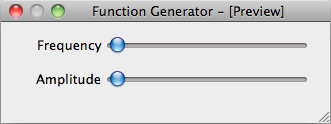

.. _ui-driver:

==================================
Connecting a custom UI to a driver
==================================

While the test widget is very convenient is not good enough for visually attractive applications. You can design you own custom user interface using Qt Designer and then connect it to your driver in a very simple way. Consider the following interace for our custom signal generator.

You can set the frequency and amplitude using sliders. The sliders are named `frequency` and `amplitude`.

The long way
------------

You can connect each relevant driver Feat to the corresponding widget::

    import sys

    # Import lantz.ui register an import hook that will replace calls to Qt by PyQt4 or PySide ...
    import lantz.ui

    # and here we just use Qt and will work with both bindings!
    from Qt.QtGui import QApplication, QWidget
    from Qt.uic import loadUi

    # From lantz we import the driver ...
    from lantz.drivers.examples.fungen import LantzSignalGeneratorTCP

    # and a function named connect_feat that does the work.
    from lantz.ui.qtwidgets import connect_feat

    app = QApplication(sys.argv)

    # We load the UI from the QtDesigner file. You can also use pyuic4 to generate a class.
    main = loadUi('connect_test.ui')

    # We get a reference to each of the widgets.
    frequency_widget = main.findChild((QWidget, ), 'frequency')
    amplitude_widget = main.findChild((QWidget, ), 'amplitude')

    with LantzSignalGeneratorTCP('localhost', 5678) as inst:

        # We connect each widget to each feature
        # The syntax arguments are widget, target (driver), Feat name
        connect_feat(frequency_widget, inst, 'frequency')
        connect_feat(amplitude_widget, inst, 'amplitude')
        main.show()
        exit(app.exec_())

and that is all. Under the hood `connect_feat` is:

    1.- Wrapping the widget to make it Lantz compatible.

    2.- If applicable, configures minimum, maximum, steps and units.

    3.- Add a handler such as when the widget value is changed, the Feat is updated.

    4.- Add a handler such as when the Feat value is changed, the widget is updated.

The short way
-------------

If you have named the widgets according to the Feat name as we have done, you can save some typing (not so much here but a lot in big interfaces)::

    import sys

    # Import lantz.ui register an import hook that will replace calls to Qt by PyQt4 or PySide ...
    import lantz.ui

    # and here we just use Qt and will work with both bindings!
    from Qt.QtGui import QApplication, QWidget
    from Qt.uic import loadUi

    # From lantz we import the driver ...
    from lantz.drivers.examples.fungen import LantzSignalGeneratorTCP

    # and a function named connect_driver that does the work.
    from lantz.ui.qtwidgets import connect_driver

    app = QApplication(sys.argv)

    # We load the UI from the QtDesigner file. You can also use pyuic4 to generate a class.
    main = loadUi('connect_test.ui')

    with LantzSignalGeneratorTCP('localhost', 5678) as inst:

        # We connect the parent widget (main) to the instrument.
        connect_driver(main, inst)
        main.show()
        exit(app.exec_())

Notice that now we do not need a reference to the widgets (only to the parent widget, here named main). And we call `connect_driver` (instead of `connect_feat`) without specifying the feat name. Under the hood, `connect_driver` is iterating over all widgets and checking if the driver contains a Feat with the widget name. If it does, it executes `connect_feat`.

.. seealso::

    :ref:`ui-feat-two-widgets`

    :ref:`ui-two-drivers`

