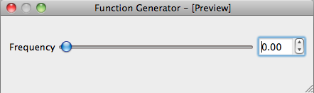

.. _ui-feat-two-widgets:

=================================================
Connecting two (or more) widgets to the same feat
=================================================

In many cases you want to have multiple widgets (e.g. different kind) connected to the same Feat. When the two widgets are together you could create a custom widget, but with Lantz it is not necessary. Consider the following UI:

You can set the frequency using the slider or the double spin box. The slider is named `frequency__slider` and the spin is named `frequency`.

The long way
------------

You can connect each relevant driver Feat to the corresponding widget::

    import sys

    # Import lantz.ui register an import hook that will replace calls to Qt by PyQt4 or PySide ...
    import lantz.ui

    # and here we just use Qt and will work with both bindings!
    from Qt.QtGui import QApplication, QWidget
    from Qt.uic import loadUi

    # From lantz we import the driver ...
    from lantz.drivers.examples.fungen import LantzSignalGeneratorTCP

    # and a function named connect_feat that does the work.
    from lantz.ui.qtwidgets import connect_feat

    app = QApplication(sys.argv)

    # We load the UI from the QtDesigner file. You can also use pyuic4 to generate a class.
    main = loadUi('connect_test.ui')

    # We get a reference to each of the widgets.
    slider = main.findChild((QWidget, ), 'frequency__slider')
    spin = main.findChild((QWidget, ), 'frequency')

    with LantzSignalGeneratorTCP('localhost', 5678) as inst:

        # We connect each widget to each feature
        # The syntax arguments are widget, target (driver), Feat name
        connect_feat(slider, inst, 'frequency')
        connect_feat(spin, inst, 'frequency')
        main.show()
        exit(app.exec_())

and that is all. Try it out and see how when you change one control the other one is updated.

The short way
-------------

If you have named the widgets according to the Feat and you have use a suffix in at least one of them, you can use `connect_driver`::

    import sys

    # Import lantz.ui register an import hook that will replace calls to Qt by PyQt4 or PySide ...
    import lantz.ui

    # and here we just use Qt and will work with both bindings!
    from Qt.QtGui import QApplication, QWidget
    from Qt.uic import loadUi

    # From lantz we import the driver ...
    from lantz.drivers.examples.fungen import LantzSignalGeneratorTCP

    # and a function named connect_feat that does the work.
    from lantz.ui.qtwidgets import connect_feat

    app = QApplication(sys.argv)

    # We load the UI from the QtDesigner file. You can also use pyuic4 to generate a class.
    main = loadUi('connect_test.ui')

    with LantzSignalGeneratorTCP('localhost', 5678) as inst:

        # We connect the parent widget (main) to the instrument.
        connect_driver(main, inst)
        main.show()
        exit(app.exec_())

Notice that now we do not need a reference to the widgets (only to the parent widget, here named main). And we call `connect_driver` (instead of `connect_feat`) without specifying the feat name. Under the hood, `connect_driver` is iterating over all widgets and checking if the driver contains a Feat with the widget name stripped from the suffix. If it does, it executes `connect_feat`.

In this example, we have use the double underscore `__` to separate the suffix. This is a good choice and also the default as can be used in Qt and Python variable names. If you want have used another separator, you can specify it by passing the `sep` keyword argument::

        connect_driver(main, inst, sep='_o_')

There is no limit in the number of widgets that you can connect to the same feat.

.. seealso::

    :ref:`ui-driver`

    :ref:`ui-two-drivers`

