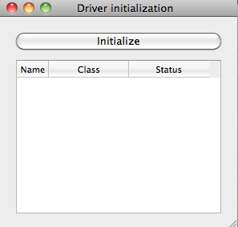
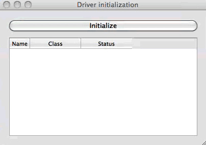

.. _ui-initializing:

======================================
Initializing multiple drivers in a GUI
======================================

A common part of an instrumentation GUI is to show a panel or a splash window
to initialize instruments while providing some visual feedback about the status.
Lantz provides a convenience method that can be hooked to different kind of widgets.

The function is called `initialize_and_report` and is defined in the widgets module::

    from lantz.ui.widgets import initialize_and_report

The signature of the function is very similar to `initialize_many`::

    def initialize_and_report(widget, drivers, register_finalizer=True,
                              initializing_msg='Initializing ...', initialized_msg='Initialized',
                              concurrent=True, dependencies=None):

Supported widgets are: `QTableWidget` (useful for a modal window), `QLineEdit`
(useful for a status bar), `QTextEdit` (useful for a log panel).

You can embed the widget in the window that you like. For example, in window like this:

The button initialize is connected to the following call::

    initialize_and_report(status_widget, self.drivers)

that will start the process of initializing all drivers (in this case some are concurrently).

(see the code for this example https://github.com/hgrecco/lantz/blob/master/examples/gui_initializing.py)

.. seealso::

    :ref:`initializing-setup`

