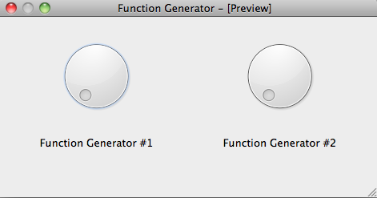

.. _ui-two-drivers:

================================
Connecting two (or more) drivers
================================

Real application consists not only of a single instrument but many. In a custom UI, you can connect different drivers to different widgets. Consider the following interace for two signal generators.

(We use twice the same kind for simplicity, but it is not necessary).

The widgets are named `fungen1__frequency` and `fungen2__frequency`.

For *educational* purposes, we show you four ways to do this. You will certainly use only the last and shortest way but showing you how it is done allows you to understand what is going on.

The long way
------------

Get a reference to each widget and connect them manually::

    import sys

    # Import Qt related from lantz so it worsk with PyQt4 or PySide ...
    from lantz.utils.qt import QtGui

    # From lantz we import the driver ...
    from lantz.drivers.examples.fungen import LantzSignalGenerator

    # and a function named connect_feat that does the work.
    from lantz.ui.widgets import connect_feat

    app = QtGui.QApplication(sys.argv)

    # We load the UI from the QtDesigner file. You can also use pyuic4 to generate a class.
    main = QtGui.loadUi('ui-two-drivers.ui')

    # We get a reference to each of the widgets.
    freq1 = main.findChild((QtGui.QWidget, ), 'fungen1__frequency')
    freq2 = main.findChild((QtGui.QWidget, ), 'fungen2__frequency')

    with LantzSignalGenerator('TCPIP::localhost::5678::SOCKET') as inst1, \
         LantzSignalGenerator('TCPIP::localhost::5678::SOCKET') as inst2:

        # We connect each widget to each feature
        # The syntax arguments are widget, target (driver), Feat name
        connect_feat(freq1, inst1, 'frequency')
        connect_feat(freq2, inst2, 'frequency')
        main.show()
        exit(app.exec_())

The not so long way
-------------------

If you have use a prefix to solve the name collision you can use it and connect the driver::

    import sys

    # Import Qt related from lantz so it worsk with PyQt4 or PySide ...
    from lantz.utils.qt import QtGui

    # From lantz we import the driver ...
    from lantz.drivers.examples.fungen import LantzSignalGenerator

    # and a function named connect_feat that does the work.
    from lantz.ui.widgets import connect_feat

    app = QtGui.QApplication(sys.argv)

    # We load the UI from the QtDesigner file. You can also use pyuic4 to generate a class.
    main = QtGui.loadUi('ui-two-drivers.ui')

    with LantzSignalGenerator('TCPIP::localhost::5678::SOCKET') as inst1, \
         LantzSignalGenerator('TCPIP::localhost::5678::SOCKET') as inst2:

        # We connect each widget to each feature
        # The syntax arguments are widget, target (driver), Feat name
        connect_driver(main, inst1, prefix='fungen1')
        connect_driver(main, inst2, prefix='fungen1')
        main.show()
        exit(app.exec_())

This does not look like too much saving but if more than one Feat per driver to connect, `connect_driver` will do them all for you. Under the hood, `connect_driver` is iterating over all widgets and checking if the driver contains a Feat with the widget name prefixed by `prefix`. Note that we have used `fungen1` instead of `fungen1__` as the prefix. That is because `connect_driver` uses the double underscore as a separator by default. You can change it by passing the `sep` keyword argument.

The short way
-------------

If you have named the widgets according to the Feat name and added a prefix corresponding to the feat::

    import sys

    # Import Qt related from lantz so it worsk with PyQt4 or PySide ...
    from lantz.utils.qt import QtGui

    # From lantz we import the driver ...
    from lantz.drivers.examples.fungen import LantzSignalGeneratorTCP

    # and a function named connect_feat that does the work.
    from lantz.ui.widgets import connect_feat

    app = QtGui.QApplication(sys.argv)

    # We load the UI from the QtDesigner file. You can also use pyuic4 to generate a class.
    main = QtGui.loadUi('ui-two-drivers.ui')

    # Notice that now we specify the instrument name!
    with LantzSignalGenerator('TCPIP::localhost::5678::SOCKET', name='fungen1') as inst1, \
         LantzSignalGenerator('TCPIP::localhost::5679::SOCKET', name='fungen2') as inst2:

        # We connect the whole main widget, and we give a list of drivers.
        connect_setup(main, [inst1, inst2])
        main.show()
        exit(app.exec_())

Under the hood, `connect_setup` iterates over all drivers in the second argument and executes `connect_driver` using the driver name.

The shortest way
----------------

As this is a commont pattern, we have a useful function for that::

    import sys

    # From lantz we import the driver ...
    from lantz.drivers.examples.fungen import LantzSignalGeneratorTCP

    # Import Qt related from lantz so it worsk with PyQt4 or PySide ...
    from lantz.ui.app import start_gui

    # Notice that now we specify the instrument name!
    with LantzSignalGenerator('TCPIP::localhost::5678::SOCKET', name='fungen1') as inst1, \
         LantzSignalGenerator('TCPIP::localhost::5679::SOCKET', name='fungen2') as inst2:

        start_gui('connect_test.ui', [inst1, inst2], sys.argv)

.. seealso::

    :ref:`ui-driver`

    :ref:`ui-feat-two-widgets`

