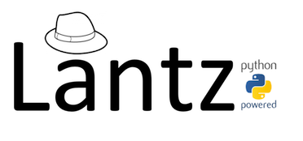

Welcome to Lantz
----------------

Lantz is an automation and instrumentation toolkit with a clean, well-designed
and consistent interface. It provides a core of commonly used functionalities
for building applications that communicate with scientific instruments allowing
rapid application prototyping, development and testing. Lantz benefits from
Python's extensive library flexibility as a glue language to wrap existing
drivers and DLLs. Lantz aims to provide a library of curated and well documented
instruments drivers.

    | :ref:`about`
    | Lantz Philosophy and design principles.
    |
    | :ref:`overview`
    | A short tour of Lantz features.
    |
    | :ref:`faq`
    | Frequently asked questions and their answers.
    |
    | :ref:`community`
    | Getting in touch with users and developers.

Learn
-----

    | :ref:`tutorials`
    | Step-by-step instructions to install, use and build drivers using Lantz.
    |
    | :ref:`guides`
    | Task oriented guides.

More information
----------------

    | :ref:`contributing`
    | We need your brain.
    |
    | :ref:`drivers`
    | List of Lantz drivers.
    |
    | :ref:`api`
    | Application programming interface reference.

Indices and tables
------------------

    | :ref:`genindex`
    | Lists all sections and subsections.
    |
    | :ref:`modindex`
    | All functions, classes, terms.
    |
    | :ref:`search`
    | Search this documentation.

.. toctree::
   :hidden:

   about
   overview
   tutorial/index
   guides/index
   faq
   drivers/index
   api/index
   contributing
   contributing-drivers
   contributing-core
   agreement
   community
   bugs

----

*We thank* `GlugCEN <http://glugcen.dc.uba.ar/>`_ *for hosting the code, the docs and the mailing list*
