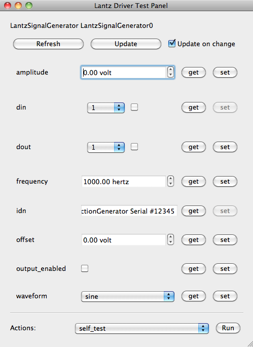

.. _overview:

========
Overview
========

A minimal script to control a function generator using Lantz might look like this::

    from lantz import Q_

    from lantz.drivers.aeroflex import A2023aSerial

    fungen = A2023aSerial('COM1')
    fungen.initialize()

    print(fungen.idn)
    fungen.frequency = Q_(20, 'MHz')
    print(fungen.amplitude)
    fungen.sweep()

    fungen.finalize()

The code is basically self explanatory, and does not differ too much of what you would write if you write a driver from scratch. But there are a few important things going under the hood that makes Lantz useful for instrumentation. Let's take a look!

Logging
-------

While building and running your program it is invaluable to monitor its state. Lantz gives to all your drivers automatic logging.

The default level is logging.INFO, but if you prepend  the following lines to the previous example::

    import logging
    from lantz import log_to_screen
    log_to_screen(logging.DEBUG)

You will see the instance initializing and how and when each property is accessed. Loggers are organized by default with the following naming convention::

    lantz.<class name>.<instance name>

which for this case becomes::

    lantz.A2023aSerial.A2023aSerial0

because no name was given. If you want to specify a name, do it at object creation::

    fungen = A2023aSerial('COM1', name='white')

Separation into multiple loggers makes finding problems easier and enables fine grained control over log output.

By the way, if you are running your program from an IDE or you don't want to clutter your current terminal, you can log to a socket and view the log output in another window (even in another computer, but we leave this for latter). Open first another terminal and run::

    $ lantzmonitor.py -l 1

(If you want a nicer user interface with filtering and searching capabilities, try LogView http://code.google.com/p/logview/)

To your python program, replace the logging lines by::

    import logging
    from lantz import log_to_socket
    log_to_socket(logging.DEBUG)

When you run it, you will see the log appearing in the logging window.

By the way, `lantzmonitor` is more than log to screen dumper. Tailored for lantz, it can display instrument specific messages as well as an on-line summary indicating the current value for each property. Hopefully, you will never need to add a print statement in your program any more!

Timing
------

.. TODO Partially implemented

Basic statistics of instrument related function calls are kept to facilitate bottleneck identification. While this is not as powerful as python profiler, its much easier to use within your application. You can obtain the statistics for a particular operation using::

    fungen.timing.stats('set_frequency')

This will return a named tuple with the following fields::

    - last: Execution time of last set operation
    - count: Number of times the setter was called
    - mean: Mean execution time of all set operations
    - std: Standard deviation of the execution time of all set operations
    - min: Minimum execution time of all set operations
    - max: Maximum execution time of all set operations

Similarly, you can obtain timing statistics of the getter calling::

    fungen.timing.stats('get_frequency')

Cache
-----

Setting and getting drivers properties always does it in the instrument. However, accessing the instrument is time consuming and many times  you just want to a way to recall the last known value. Lantz properties carry their own cache, which can be accessed with the recall method::

    >>> fungen.recall('amplitude')
    20 V

You can also access multiple elements::

    >>> fungen.recall(('amplitude', 'voltage'))
    {'frequency': 20 MHz, 'amplitude': 20 V}

Using recall without arguments gets all defined feats

    >>> fungen.recall()
    {'frequency': 20 MHz, 'amplitude': 20 V, 'ac_mode': True }

Prevent unnecessary set
-----------------------

The internal cache also prevents unnecessary communication with the instrument::

    >>> fungen.amplitude = 20 # The amplitude will be changed to 20
    >>> fungen.amplitude = 20 # The amplitude is already 20, so this will be ignored.

If you are not sure that the current state of the instrument matches the cached value, you can force a setting change as will be described below.

Getting and setting multiple values in one line
-----------------------------------------------

You can use the refresh method to obtain multiple values from the instrument::

    >>> print(fungen.refresh('amplitude')) # is equivalent to print(fungen.amplitude)
    20 V

    >>> print(fungen.refresh(('frequency', 'amplitude'))) # You can refresh multiple properties at once
    {'frequency': 20 MHz, 'amplitude': 20 V}

    >>> print(fungen.refresh()) # You can refresh all properties at once
    {'frequency': 20 MHz, 'amplitude': 20 V, 'ac_mode': True }

The counterpart of refresh is the update method that allows you to set multiple values in a single line::

    >>> fungen.update(ac_mode=True) # is equivalent to fungen.ac_mode = True

    >>> fungen.update({'ac_mode': True})  # Can be also used with a dictionary

    >>> fungen.update(ac_mode=True, amplitude=Q(42, 'V')) # if you want to set many, just do

    >>> fungen.update({'ac_mode': True, 'amplitude': Q(42, 'V')}) # or this

The cache is what allows to Lantz to avoid unnecessary communication with the instrument. You can overrule this check using the update method::

    >>> fungen.amplitude = Q(42, 'V')

    >>> fungen.amplitude = Q(42, 'V') # No information is set to the instrument as is the value already set

    >>> fungen.update(amplitude=Q(42, 'V'), force=True) # The force true argument ignores cache checking

This can be useful for example when the operator might change the settings using the manual controls.

Effortless asynchronous get and set
-----------------------------------

Lantz also provides out of the box asynchronous capabilities for all methods described before. For example::

    >>> fungen.update_async({'ac_mode': True, 'amplitude': Q(42, 'V')})
    >>> print('I am not blocked!')

will update `ac_mode` and `amplitude` without blocking, so the print statement is executed even if the update has not finished. This is useful when updating multiple independent instruments. The state of the operation can be verified using the returned :py:class:`concurrent.futures.Future` object:

    >>> result1 = fungen.update_async({'ac_mode': True, 'amplitude': Q(42, 'V')})
    >>> result2 = another_fungen.update_async({'ac_mode': True, 'amplitude': Q(42, 'V')})
    >>> while not result1.done() and not result2.done()
    ...     DoSomething()

Just like `update_async`, you can use `refresh_async` to obtain the value of one or more features. The result is again a :py:class:`concurrent.futures.Future` object whose value can be queried using the result method :py:meth:`concurrent.futures.Future.result`

    >>> fut = obj.refresh_async('eggs')
    >>> DoSomething()
    >>> print(fut.result())

Async methods accept also a callback argument to define a method that will be used

.. topic:: Under the hood

    Single thread for the instrument

Context manager
---------------

If you want to send a command to an instrument only once during a particular script, you might want to make use of the context manager syntax. In the following example, the driver will be created and initialized in the first line and finalized when the `with` clause finishes even when an unhandled exception is raised::

    with A2023aSerial('COM1') as fungen:

        print(fungen.idn)
        fungen.frequency = Q_(20, 'MHz')
        print(fungen.amplitude)
        fungen.sweep()

Units
-----

Instrumentation software need to deal with physical units, and therefore you need to deal with them. Keeping track of the units of each variable in time consuming and error prone, and derives into annoying naming practices such as `freq_in_KHz`. Lantz aims to reduce the burden of this by incorporating units using the Pint_ package. The Quantity object si abbreviated withing Lantz as `Q_` and can be imported from the root::

    from lantz import Q_

    mv = Q_(1, 'mV') # we define milivolt
    value = 42 * mv # we can use the defined units like this
    thesame = Q_(42, 'mv') # or like this

This makes the code a little more verbose but is worth the effort. The code is more explicit and less error prone. It also allows you to do thing like this::

    from lantz import Q_

    from lantz.drivers.example import OneFunGen as FunGen
    # In OneFunGen, the amplitude of this function generator must be set in Volts.

    with FunGen('COM1') as fungen:

        fungen.frequency = Q_(0.05, 'V')

Later you decide to change the function generator by a different one, with a different communication protocol::

    from lantz import Q_

    from lantz.drivers.example import AnotherFunGen as FunGen
    # In AnotherFunGen, the amplitude of this function generator must be set in milivolts.

    with FunGen('COM1') as fungen:

        fungen.frequency = Q_(0.05, 'V') # the value is converted from volts to mV inside the driver.

Apart from the import, nothing has changed. In a big code base this means that you can easily replace one instrument by another.

You might want to use the value obtained in one instrument to set another. Or you might want to use the same value in two different instruments without looking into their specific details::

    from lantz import Q_

    from lantz.drivers.example import FrequenceMeter
    from lantz.drivers.aeroflex import A2023aSerial
    from lantz.drivers.standford import SR844

    with FrequenceMeter('COM1') as fmeter, \
         A2023aSerial('COM2') as fungen, \
         SR844('COM3') as lockin:

        freq = fmeter.frequency

        fungen.frequency = freq
        lockin.frequency = freq

In case you are not convinced, a small technical note:

.. note::

    The MCO MIB has determined that the root cause for the loss of the MCO spacecraft was the failure to use metric units in the coding of a ground software file, “Small Forces,” used in trajectory models. Specifically, thruster performance data in English units instead of metric units was used in the software application code titled SM_FORCES (small forces). The output from the SM_FORCES application code as required by a MSOP Project Software Interface Specification (SIS) was to be in metric units of Newtonseconds (N-s). Instead, the data was reported in English units of pound-seconds (lbf-s). The Angular Momentum Desaturation (AMD) file contained the output data from the SM_FORCES software. The SIS, which was not followed, defines both the format and units of the AMD file generated by ground-based computers. Subsequent processing of the data from AMD file by the navigation software algorithm therefore, underestimated the effect on the spacecraft trajectory by a factor of 4.45, which is the required conversion factor from force in pounds to Newtons. An erroneous trajectory was computed using this incorrect data.

            `Mars Climate Orbiter Mishap Investigation Phase I Report`
            `PDF <ftp://ftp.hq.nasa.gov/pub/pao/reports/1999/MCO_report.pdf>`_

User interface
--------------

Providing a powerful GUI is an important aspect of developing an application for end user. Lantz aims to simplify the UI development by allowing you to correctly connect to `Lantz` Feats and Actions to widgets without any effort. For example, if you generate a GUI using Qt Designer::

    # imports not shown

    main = loadUi('connect_test.ui') # Load the GUI

    with LantzSignalGeneratorTCP() as fungen: # Instantiate the instrument

        connect_driver(main, fungen) # All signals and slots are connected here!

        # Do something

Additionally it provides automatic generation of Test Panels, a very useful feature when you are building or debugging a new driver::

    # imports not shown

    with LantzSignalGeneratorTCP() as fungen: # Instantiate the instrument
        start_test_app(inst)               # Create

and you get:

Check out the :ref:`tutorials` to get started!

.. _Pint: https://pint.readthedocs.org/
