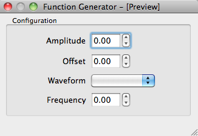

.. _tutorial-gui-app:

A simple GUI app
================

In this part of the tutorial you will build an application to do a frequency
scan like in the previous tutorial (:ref:`tutorial-cli-app`) but with a
graphical frontend.

Start the simulated instrument running the following command::

    $ lantz-sim fungen tcp

Using Qt Designer, create a window like this:

and save it as `scanfrequency.ui` in the folder in which you have created
the driver (:ref:`tutorial-building`). For the example, we have labeled
each control as corresponding label in lower caps (amplitude, offset,
waveform, start, stop, step, wait). The button is named `scan`.
You can also download
:download:`the ui file <../_static/tutorial/scanfrequency.ui>` if you prefer.

Notice that the `amplitude` and `offset` don't show units and that the `waveform`
combobox is not populated. These widgets will be connected to the corresponding
Feats of the drivers and Lantz will take care of setting the right values, items,
etc.

Create a python file named `scanfrequency-gui.py` with the following content::

    import sys

    # Import lantz.ui register an import hook that will replace calls to Qt by PyQt4 or PySide ...
    import lantz.ui

    # and here we just use Qt and will work with both bindings!
    from Qt.QtGui import QApplication, QWidget
    from Qt.uic import loadUi

    app = QApplication(sys.argv)

    # Load the UI from the QtDesigner file. You can also use pyuic4 to generate a class.
    main = loadUi('scanfrequency.ui')

    # Start the app
    main.show()
    exit(app.exec_())

Run this stub should display the window::

    $ python scanfrequency-gui.py

.. note:: In Windows, you can use `pythonw` instead of `python` to suppress the
   terminal window.

We will now add the code to do the actual frequency scan. We will reuse the
function from the last tutorial::

    import sys

    # Import lantz.ui register an import hook that will replace calls to Qt by PyQt4 or PySide ...
    import lantz.ui
    from lantz import Q_

    # and here we just use Qt and will work with both bindings!
    from Qt.QtGui import QApplication, QWidget
    from Qt.uic import loadUi

    # These imports are from your own project
    from mydriver import LantzSignalGeneratorTCP
    from scanfrequency import scan_frequency

    app = QApplication(sys.argv)

    # Load the UI from the QtDesigner file. You can also use pyuic4 to generate a class.
    main = loadUi('scanfrequency.ui')

    Hz = Q_(1, 'Hz')
    sec = Q_(1, 'second')

    with LantzSignalGeneratorTCP('localhost', 5678) as inst:

        # Obtain a reference to the widgets controlling the scan parameters
        start = main.findChild((QWidget, ), 'start')
        stop = main.findChild((QWidget, ), 'stop')
        step = main.findChild((QWidget, ), 'step')
        wait = main.findChild((QWidget, ), 'wait')
        scan = main.findChild((QWidget, ), 'scan')

        # Define a function to read the values from the widget and call scan_frequency
        def scan_clicked():
            scan_frequency(inst, start.value() * Hz, stop.value() * Hz,
                           step.value() * Hz, wait.value() * sec)

        # Connect the clicked signal of the scan button to the function
        scan.clicked.connect(scan_clicked)

        # Scan the app
        main.show()
        exit(app.exec_())

When the button is clicked, Qt will emit a signal which is connected to the
function we have defined the application should scan the frequency. You will
not see anything happening in the Window, but if you look in the simulator
console you will see the frequency changing.

Connecting widgets to Feats
---------------------------

To allow the user to change the amplitude, offset, shape and frequency, we will
connect the configuration widgets::

    import sys

    # Import lantz.ui register an import hook that will replace calls to Qt by PyQt4 or PySide ...
    import lantz.ui
    from lantz import Q_

    # and here we just use Qt and will work with both bindings!
    from Qt.QtGui import QApplication, QWidget
    from Qt.uic import loadUi

    # Import from lantz a function to connect drivers to UI <--- NEW
    from lantz.ui.qtwidgets import connect_driver

    # These imports are from your own project
    from mydriver import LantzSignalGeneratorTCP
    from scanfrequency import scan_frequency

    app = QApplication(sys.argv)

    # Load the UI from the QtDesigner file. You can also use pyuic4 to generate a class.
    main = loadUi('scanfrequency.ui')

    Hz = Q_(1, 'Hz')
    sec = Q_(1, 'second')

    with LantzSignalGeneratorTCP('localhost', 5678) as inst:

        # Obtain a reference to the widgets controlling the scan parameters
        start = main.findChild((QWidget, ), 'start')
        stop = main.findChild((QWidget, ), 'stop')
        step = main.findChild((QWidget, ), 'step')
        wait = main.findChild((QWidget, ), 'wait')
        scan = main.findChild((QWidget, ), 'scan')

        # <--------- This is new --------->
        connect_driver(main, inst)

        progress = main.findChild((QWidget, ), 'progress')

        def update_progress_bar(new, old):
            fraction = (new.magnitude - start.value()) / (stop.value() - start.value())
            progress.setValue(fraction * 100)

        inst.frequency_changed.connect(update_progress_bar)

        # Define a function to read the values from the widget and call scan_frequency
        def scan_clicked():
            scan_frequency(inst, start.value() * Hz, stop.value() * Hz,
                           step.value() * Hz, wait.value() * sec)

        # Connect the clicked signal of the scan button to the function
        scan.clicked.connect(scan_clicked)

        # Scan the app
        main.show()
        exit(app.exec_())

The function `connect_driver` matches by name Widgets to Feats and then connects
them. Under the hood, for each match it:

    1.- Wraps the widget to make it Lantz compatible.

    2.- If applicable, configures minimum, maximum, steps and units.

    3.- Add a handler such as when the widget value is changed, the Feat is updated.

    4.- Add a handler such as when the Feat value is changed, the widget is updated.

You can learn more and some alternatives in :ref:`ui-driver`.

To update the progress bar, we connected the `frequency_changed` signal to a
function that updates the progress bar.

Run this example and test how you can change the amplitude, offset and waveform::

    $ python scanfrequency-gui.py

However, you will see that the frequency and the progress bar are not updated
during the scan.

Using a background thread
-------------------------

The drawback of the previous (simple) approach is that the scan is executed in the same
thread as the GUI, effectively locking the main window and making the application
unresponsive. Qt Multithreading programming is out of the scope of this tutorial
(checkout `Threads in Qt`_ for more info), but we will provide some examples
how to do it::

    import sys

    # Import lantz.ui register an import hook that will replace calls to Qt by PyQt4 or PySide ...
    import lantz.ui
    from lantz import Q_

    # Import from lantz a function to connect drivers to UI
    from lantz.ui.qtwidgets import connect_driver

    # and here we just use Qt and will work with both bindings!
    from Qt.QtGui import QApplication, QWidget
    from Qt.uic import loadUi

    # We import
    from Qt.QtCore import QThread, QObject

    # These imports are from your own project
    from mydriver import LantzSignalGeneratorTCP
    from scanfrequency import scan_frequency

    app = QApplication(sys.argv)

    # Load the UI from the QtDesigner file. You can also use pyuic4 to generate a class.
    main = loadUi('scanfrequency.ui')

    Hz = Q_(1, 'Hz')
    sec = Q_(1, 'second')

    with LantzSignalGeneratorTCP('localhost', 5678) as inst:

        # Connect the main panel widgets to the instruments Feats,
        # matching by name
        connect_driver(main, inst)

        # Obtain a reference to the widgets controlling the scan parameters
        start = main.findChild((QWidget, ), 'start')
        stop = main.findChild((QWidget, ), 'stop')
        step = main.findChild((QWidget, ), 'step')
        wait = main.findChild((QWidget, ), 'wait')
        scan = main.findChild((QWidget, ), 'scan')
        progress = main.findChild((QWidget, ), 'progress')

        def update_progress_bar(new, old):
            fraction = (new.magnitude - start.value()) / (stop.value() - start.value())
            progress.setValue(fraction * 100)

        inst.frequency_changed.connect(update_progress_bar)

        # <--------- New code--------->
        # Define a function to read the values from the widget and call scan_frequency
        class Scanner(QObject):

            def scan(self):
                # Call the scan frequency
                scan_frequency(inst, start.value() * Hz, stop.value() * Hz,
                               step.value() * Hz, wait.value() * sec)
                # When it finishes, set the progress to 100%
                progress.setValue(100)

        thread = QThread()
        scanner = Scanner()
        scanner.moveToThread(thread)
        thread.start()

        # Connect the clicked signal of the scan button to the function
        scan.clicked.connect(scanner.scan)

        app.aboutToQuit.connect(thread.quit)
        # <--------- End of new code --------->

        main.show()
        exit(app.exec_())

In Qt, when a signal is connected to a slot (a function of a QObject),
the execution occurs in the Thread of the receiver (not the emitter).
That is why we moved the QObject to the new thread.

.. note::
   On a production app it would be good to add a lock to prevent the application
   from exiting or calling the scanner while a scanning is running.

.. _`Thread in Qt`: http://doc.qt.digia.com/4.7/threads.html
