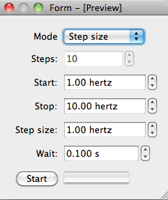
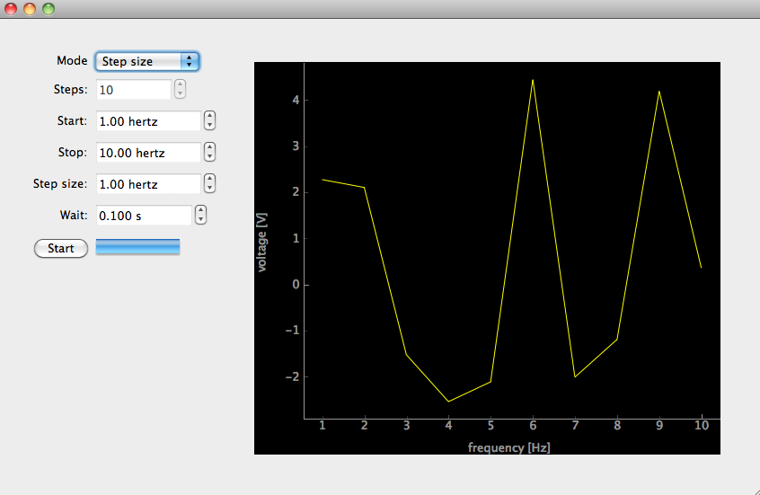

.. _tutorial-gui-rich-app:

A rich GUI app
==============

Building a rich, responsive and reusable app is tough. In this part of the tutorial you learn how Lantz makes it simpler by build an application using Blocks and :class:Backend and :class:Frontend classes.

This is the wish list for our application:

    - Should measure with a voltmeter as we scan the frequency in a function generator.
    - The user should be able to change the range and step of the frequency scan.
    - The user should be able to cancel the scan at any moment.
    - Plot the results live

First, as we have done before start the simulated function generator running the following command::

    $ lantz-sim fungen tcp

We will also start simulated instrument running the following command in another terminal::

    $ lantz-sim voltmeter tcp -p 5679

Let's test our two instruments before start:

.. code-block:: python

    from lantz import Q_
    from lantz.drivers.examples import LantzSignalGenerator, LantzVoltmeter

    # We change the frequency of the function generator
    with LantzSignalGenerator('TCPIP::localhost::5678::SOCKET') as fungen:
        print(fungen.idn)
        fungen.frequency = Q_(3.14, 'Hz')

    # We measure the voltage in channel 0 of the voltmeter
    with LantzVoltmeter('TCPIP::localhost::5679::SOCKET') as voltmeter:
        print(voltmeter.idn)
        print(voltmeter.voltage[0])

Now that everything works, let's make the app!

The scanner
-----------

Scanning (a frequency, a voltage, etc.) is a very common task in instrumentation applications. That is why lantz provide a building block (usually called just blocks) for this. It is called :class:FeatScan

.. code-block:: python

    # We import a helper function to start the app
    from lantz.ui.app import start_gui_app

    # The block consists of two parts the backend and the frontend
    from lantz.ui.blocks import FeatScan, FeatScanUi

    # An this you know already
    from lantz.drivers.examples import LantzSignalGenerator

    with LantzSignalGenerator('TCPIP::localhost::5678::SOCKET') as fungen:

        # Here we instantiate the backend setting 'frequency' as the Feat to scan
        # and specifying in which instrument
        app = FeatScan('frequency', instrument=fungen)

        # Now we use the helper to start the app.
        # It takes a Backend instance and a FrontEnd class
        start_gui_app(app, FeatScanUi)

Save it, run it and how the Feat is scanned in the simulator. In no time you build a responsive and interactive application in which you can choose the start and stop value, the number of steps or the step size, the interval between calls like the one you see below:

Blocks are small, reusable, composable and easy to use. They do one thing, and they do it right. Combining multiple blocks you can build a complex and rich application. There are many available blocks and you can build your own. We will not go into details right now but it is only important that you know that blocks can derive from one of two classes: :class:Backend and :class:Frontend. The first contains the logic of your application and the second the GUI. This keeps things easier to test and develop. It also allows you to call you application without any GUI (for example from the command line) or with a different GUI (for example a debug GUI with more information).

Measuring
---------

Now we need to measure in the voltmeter in each step. There is a really simple way to do it. A :class:FeatScan object exposes an attribute (`body`) in which you can hook a function. The function should take three arguments:

    - counter: the step number from 0..N-1
    - new_value: the feat value that was used
    - overrun: a boolean indicating that executing the body is taking longer than the interval that you have allocated.

.. code-block:: python

    # We import a helper function to start the app
    from lantz.ui.app import start_gui_app

    # The block consists of two parts the backend and the frontend
    from lantz.ui.blocks import FeatScan, FeatScanUi

    # An this you know already
    from lantz.drivers.examples import LantzSignalGenerator, LantzVoltmeter

    with LantzSignalGenerator('TCPIP::localhost::5678::SOCKET') as fungen, \
         LantzVoltmeter('TCPIP::localhost::5679::SOCKET') as voltmeter:

        def measure(counter, new_value, overrun):
            print(new_value, voltmeter.voltage[0])

        app = FeatScan('frequency', instrument=fungen)

        # Here we are telling the FeatScan backend to call the measure function
        # in each scan step. It will build a
        app.body = measure

        # Now we use the helper to start the app.
        # It takes a Backend instance and a FrontEnd class
        start_gui_app(app, FeatScanUi)

That's it! You can put in the body anything that you like: waiting, changing the scale, etc. The only rule is that the backend is not aware of the Frontend. So ... how are we going to plot?

Composing an application
------------------------

We are going to create an application embedding the FeatScan. In the backend we will add an InstrumentSlot for the voltmeter: this tells Lantz that an instrument is necessary. We will also add a Signal to tell the GUI to plot new data.

.. Note:: Why a signal? Qt Signals is a way of async communication between objects. It is a way in which one object can inform others that something has happend. A signal is emitted by an object and received by another in an slot (a function). You need connect signals and slots for this to happen. Why we cannot just call the frontend? If you call the frontend, the backend will not be able to do anything until the frontend finishes. Emitting a signal tells the frontend to do something but without disturbing the backend job.

In the frontend, we will connect this signal to a Plot function (you will need pyqtgraph for this). Try installing it with::

    $ pip install pyqtgraph

.. code-block:: python

    # We import a helper function to start the app
    from lantz.ui.app import start_gui_app

    # Import Qt modules from lantz (pyside and pyqt compatible)
    from lantz.utils.qt import QtCore

    # We import the FeatScan backend and
    # the ChartUi a frontend with a chart.
    # You require pyqtgraph for this.
    from lantz.ui.blocks import FeatScan, FeatScanUi, ChartUi, HorizonalUi

    from lantz.ui.app import Backend, start_gui_app, InstrumentSlot

    # We first create our backend
    class MyApp(Backend):

        # We embed the FeatScan app.
        # Notice that we put the class, not an instance of it.
        scanner = FeatScan

        # The app needs an instrument that will be available in the voltmeter attribute
        # It also needs another instrument to scan, but this is included in FeatScan
        voltmeter = InstrumentSlot

        # This signal will be emitted when new data is available.
        # The two values are the x and y values
        new_data = QtCore.Signal(object, object)

        def __init__(self, *args, **kwargs):
            super().__init__(*args, **kwargs)

            # We assign the scanner body to our function.
            self.scanner.body = self.measure

        def measure(self, counter, new_value, overrun):

            # We measure and we emit a signal.
            # Remember that these values have units!!
            self.new_data.emit(new_value, self.voltmeter.voltage[0])

    # This will be our Frontend
    # We inherite from HorizonalUi, which organizes the widgets automatically horizontally
    class MyGui(HorizonalUi):

        # We embed two existing Frontends. Notice that agian

        # The FeatScanUi, which you know alredy.
        # But we say that it will be using the scanner backend
        # Notice that we put the class, not an instance of it.
        scanui = FeatScanUi.using('scanner')

        # The ChartUi, which plot a dataset point-by-point using pyqtgraph
        chartui = ChartUi

        # Here we tell HorizonalUi how we want to organize the widgets
        # Notice that we need to put the names of the attributes as strings.

        parts = ('scanui',    # The FeatScanUi will be in the first colum
                              #  and connected to the embedded scanner backend
                 'chartui')   # The ChartUI will be in the second column.

        def connect_backend(self):

            # This method is called after gui has been loaded (referenced in self.widget)
            # and the backend is connected to the frontend (referenced in self.backend).
            # In this case, we use it to connect the new_data signal of the backend
            # with the plot function in ChartUi
            self.backend.new_data.connect(self.chartui.plot)

            # To clear the chart every time we start a new scan
            # we connect the request start signal of the user interface
            # to the clear method of the chart ui
            self.scanui.request_start.connect(self.chartui.clear)

            super().connect_backend()

            # We define the labels and the units to use

            # For the y axis, it is fixed.
            self.chartui.ylabel = 'voltage'
            self.chartui.yunits = 'V'

            # For the x axis, depends on the feat selected by the user.
            self.chartui.xlabel = self.backend.scanner.feat_name
            self.chartui.xunits = self.backend.scanner.feat_units

            # Notice that the units is not just a change to the label,
            # it rescales the values that are shown in the plot.

    if __name__ == '__main__':
        # An this you know already
        from lantz.drivers.examples import LantzSignalGenerator, LantzVoltmeter

        with LantzSignalGenerator('TCPIP::localhost::5678::SOCKET') as fungen, \
             LantzVoltmeter('TCPIP::localhost::5679::SOCKET') as voltmeter:

            app = MyApp(instrument=fungen, voltmeter=voltmeter,
                        scanner={'feat_name': 'frequency'})

            # Now we use the helper to start the app.
            # It takes a Backend instance and a FrontEnd class
            start_gui_app(app, MyGui)

Run it and you will see something like this:

There is much more to know. Hopefully this tutorial get's you started.
